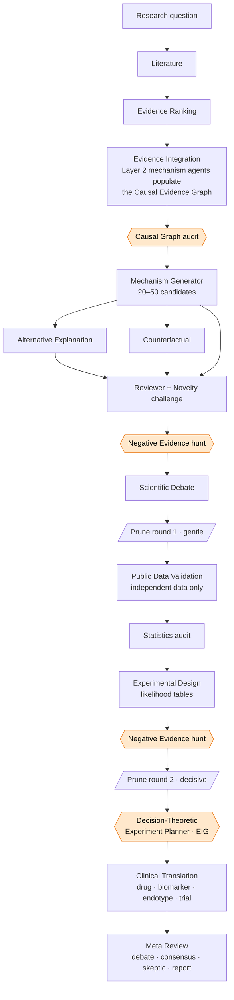
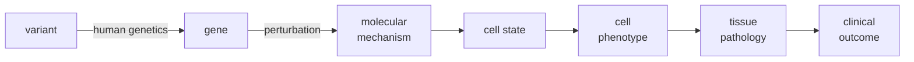

# Architecture

## Evidence flow



The four orange nodes are the novel cross-cutting capabilities. Everything between
`Prune round 1` and `Prune round 2` is where the system *accumulates causal evidence*
(validation upgrades chain edges) while *eliminating weak hypotheses* (negative
evidence + statistics + debate erode belief).

## The causal chain a hypothesis must own



Belief is bounded by the **weakest edge** in this chain. Proposed links start at
review-tier and are upgraded only when perturbation / genetic / independent-validation
evidence lands on them — so a mechanism becomes believable exactly to the degree it
becomes causal.

## Evidence tiers (Evidence Ranking Agent)

| Tier | Weight | Example |
|------|-------:|---------|
| Human genetics (fine-map + coloc + functional SNP) | 1.00 | `rs2004640 → IRF5`, colocalized eQTL |
| Perturbation (CRISPR / Perturb-seq / base-edit) | 0.85 | B-cell `Irf5` base-edit KO abolishes ABCs |
| Animal (in vivo) | 0.60 | `Irf5⁻/⁻` lupus mouse |
| Association (observational, scRNA DE, bulk) | 0.35 | ABC fraction correlates with IRF5 |
| Review / opinion | 0.15 | narrative review |

## Belief update (per hypothesis, log-odds space)

```
logit(belief) = logit(prior)
              + chain_term          # dominant positive signal; −2.0 if no chain
              + Σ signed evidence    # validation up, reviewer/negative/stats down
              + debate_delta
chain_term    = 4·chain_score − 0.5          (chain_score = weakest-link · completeness)
signed_weight = tier_weight · strength · sign  (×0.4 if not independent → leakage guard)
```

## Decision-theoretic experiment planning

For each candidate experiment with a predicted-outcome likelihood table
`P(outcome | hypothesis)`:

```
EIG(e) = H(prior over live hypotheses) − Σ_outcome P(outcome)·H(posterior | outcome)
```

The planner ranks by `EIG / lab-months`, then greedily selects under a budget,
Bayes-updating the belief after each pick so it never buys two experiments that
discriminate the same pair. Output: the smallest discriminating set and the expected
residual uncertainty in bits.
